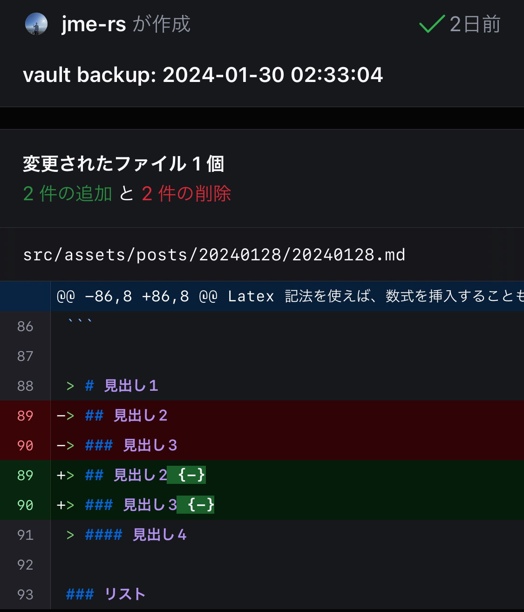

## はじめに

Markdown の良さを伝えたいので記事にしてみた。今回は第1回目。

## Markdown とは

GitHub の README でよく使われるアレのことだが、詳しくは知らないという人も割といるはず。

[Wikipedia](https://ja.m.wikipedia.org/wiki/Markdown) によると次のように説明されている。

> **Markdown**（マークダウン）は、文書を記述するための軽量マークアップ言語のひとつである。

つまり、Markdown はマークアップ言語である。マークアップ言語としてよく知られるのは HTML(Hyper Text Markup Language) だが、これらは独自の構文を持っている。

Markdown という名称も、Markup に準《なぞら》えて「より簡単に記述できる」のような意味を持っているのかもしれない。

## 活用事例

まずは説得力を上げるために、Markdown が利用されているものを挙げてみる。

- GitHub (README.md や CONTRIBUTING.md など)
- Qiita
- Zenn
- note
- Slack (チャット)
- Notion
- はてなブログ
- Jupyter Notebook
- このブログ

名だたるサービスが Markdown を利用していることがわかる。

## どんな場面で使うのか

ノート、メモなど文書で情報を管理する場面で活用できる。テキストファイルでメモを取る際にMarkdown 記法を使えば、体裁の整った意味のある文書を作成できる。

## 何が良いのか

### 専用のエディタやビューワが必要ない

Word ファイルは、複数の XML ファイルのアーカイブ形式となっている。専用のエディタがないと表示、編集することができない。ソフトを起動するのにも時間がかかる。

Markdown ファイルはテキストファイルなので、ほとんどの OS、ソフトウェアの標準で簡単に表示、編集ができる。

### GitHub で差分管理ができる

テキストファイルなので、何行目に変更がされたのかを可視化することができる。組織で管理する場合にも役立つ。



### 簡潔な文法

HTML は、タグを覚えて、終わりにもタグを書かなければならない。インデントが深くなりがちで、人間が普段使いするには向かない。

Word は GUI をポチポチしなければならない。どこに何があるのか分からないことも多いし、インデントの管理も複雑。

Markdown は基本的に簡潔な文法になっており、少ない労力で体裁の整った文書を記述することができる。

### プレーンテキストでも見やすい

Markdown は、ビューワを使うことで記述に応じた見た目で閲覧することができる。例えば、ヘッダを大きくしたり、コードブロックにシンタックスハイライトを効かせたりできる。

しかし、ビューワを用いなくても洗練された記号の使い方によって、その部分が何を意味するのかが容易に想像できる。

### 強力なエコシステム

Markdown の活用の幅は非常に広い。Pandoc というソフトを使えば、Markdown から PDF、Word、HTML、Latex など、あらゆるファイル形式に変換することができる。

Mermaid を使えば、フローチャートやシーケンス図、ガントチャート、円グラフなど、あらゆる図を生成することができる。

Latex 記法を使えば、数式を挿入することもできる

## 記述方法

参考に別の解説ページを載せておく。

https://zenn.dev/zenn/articles/markdown-guide
https://github.github.com/gfm/

### 見出し

```md
# 見出し1
## 見出し2
### 見出し3
#### 見出し4
```

> # 見出し1
> ## 見出し2 {-}
> ### 見出し3 {-}
> #### 見出し4

### リスト

#### 箇条書き

```md
- あいうえお
- かきくけこ
    - さしすせそ
    - たちってと
        - なにぬねの
- はひふへほ
```

- あいうえお
- かきくけこ
    - さしすせそ
        - たちってと
            - なにぬねの
- はひふへほ

#### 番号付き

```md
1. あいうえお
2. かきくけこ
    1. さしすせそ
    2. たちつてと
        1. なにぬねの
3. はひふへほ
```

1. あいうえお
2. かきくけこ
    1. さしすせそ
        1. たちつてと
            1. なにぬねの
3. はひふへほ

### 引用

```md
> こんにちは。
> 先日はありがとうございました。
> またよろしくお願いします。
> 
> > こんにちは。
> > 先日はありがとうございました。
> > またよろしくお願いします。
```

> こんにちは。  
> 先日はありがとうございました。  
> またよろしくお願いします。
> 
> > こんにちは。  
> > 先日はありがとうございました。  
> > またよろしくお願いします。

### テキストの装飾

```md
これは *斜体* です。
これは **強調** です。
これは ~~取り消し線~~ です。
これは `code` です。
```

これは *斜体* です。  
これは **強調** です。  
これは ~~取り消し線~~ です。  
これは `code` です。

### コードブロック

```md
    ```ts
    console.log("Markdown");
    ```

    ```ts:filename.ts
    console.log("Markdown");
    ```
```

```ts
console.log("Markdown");
```

```ts:filename.ts
console.log("Markdown");
```
### リンク

```md
[GitHub](https://github.com)

https://github.com
```

[GitHub](https://github.com)

https://github.com

### 画像

```md

```


### テーブル

```md
| Left align | Right align | Center align |
|:-----------|------------:|:------------:|
| This       | This        | This         |
| column     | column      | column       |
| will       | will        | will         |
| be         | be          | be           |
| left       | right       | center       |
| aligned    | aligned     | aligned      |
```

| Left align | Right align | Center align |
|:-----------|------------:|:------------:|
| This       | This        | This         |
| column     | column      | column       |
| will       | will        | will         |
| be         | be          | be           |
| left       | right       | center       |
| aligned    | aligned     | aligned      |

### チェックボックス

```md
- [ ] checkbox
- [x] checked
```

- [ ] checkbox
- [x] checked

### Mermaid

```md
    ```mermaid
    graph TD;
	    A-->B;
	    A-->C;
	    B-->D;
	    C-->D;
	```
```


## まとめ

Markdown の基本的なことについて紹介した。
